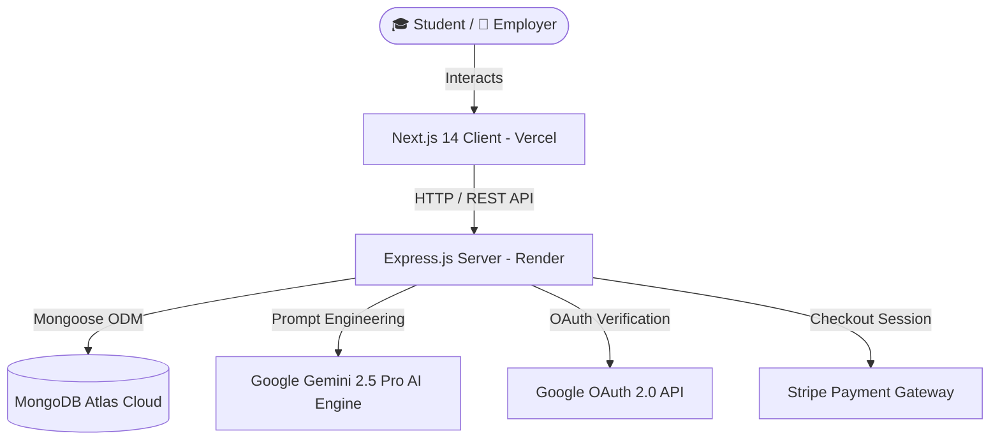

# 📌 CareerConnect Client — Agentic AI Campus Job & Internship Platform

<p align="center">
  <a href="https://career-connect-client-theta.vercel.app" target="_blank">
    
  </a>
  
  
  
  
  
</p>

> **"Your bridge from campus to career."**  
> **CareerConnect** is a full-stack, Agentic AI-powered campus recruitment ecosystem connecting Bangladeshi university students (BRACU, BUET, DU, NSU, IUT) with top local tech employers. Built with Next.js 14 App Router, TypeScript, Framer Motion, Recharts, `@react-oauth/google`, and Google Gemini 2.5 Pro.

---

## 🔗 Live Production Deployment

- 🌐 **Frontend Application**: [https://career-connect-client-theta.vercel.app](https://career-connect-client-theta.vercel.app)
- ⚙️ **Backend REST API**: [https://careerconnect-server-1.onrender.com](https://careerconnect-server-1.onrender.com)
- 💻 **Client Repository**: [https://github.com/Atahar-Shihab/CareerConnect_client](https://github.com/Atahar-Shihab/CareerConnect_client)
- ⚙️ **Server Repository**: [https://github.com/Atahar-Shihab/CareerConnect_server](https://github.com/Atahar-Shihab/CareerConnect_server)

---

## 🌟 Key Application Highlights & Features

### 🎨 1. Pinboard Design System & 5 Dynamic Theme Modes
- **Paper Corkboard (Default)**: Warm paper background (`#FDFBF7`) with deep forest pine text & sunlit marigold gold accents.
- 🌲 **Midnight Forest**: High-contrast dark green & charcoal palette (`#091A14`).
- ☀️ **Sunlit Amber**: Warm golden-amber accent palette (`#FFFBF0`).
- 🌌 **Cyberpunk Neon**: Deep space dark mode (`#0B0F19`) with cyan (`#00F2FE`) & electric pink pushpins.
- 🌸 **Sakura Blossom**: Soft pastel rose (`#FDF7F9`) with deep berry text & blush pink accents.
- **Floating Dock Navigation**: Glassmorphic pill navbar with active tab motion physics.

### 🤖 2. Triple-Engine Agentic AI Integration
- ⚡ **Smart Match Engine**: Evaluates student profile skills against job posting requirements using Google Gemini 2.5 Pro. Generates instant percentage ratings, matched skill pills, and missing skill recommendations.
- 📑 **1-Click AI Cover Letter Assistant**: Generates customized cover letters tailored to specific job postings in an interactive paper modal preview with copy-to-clipboard functionality.
- 📄 **PDF Resume Parser & Skill Extractor**: Accepts PDF resume uploads (`.pdf`), extracts text via `pdf-parse`, automatically extracts technical skills into MongoDB student profiles, and evaluates resume readiness scores.

### 💳 3. Stripe Payment Gateway Integration
- Instant Stripe Checkout integration allowing employers to upgrade to **Premium Featured Campus Postings ($10 USD)** and students to unlock **Verified Career Pro Badges ($5 USD)**.

### 📊 4. Tabbed Control Center Dashboard
- **Student Dashboard**: Skill profile builder, **Recharts Skill Readiness Index bar chart**, PDF resume dropzone, and live application tracker with status tags (*Pending*, *Reviewed*, *Accepted*).
- **Employer Dashboard**: Postings manager, candidate applicants list, and cover letter inspector.

---

## 🏗️ System Architecture & Data Flow



---

## 🛠️ Tech Stack Breakdown

| Layer | Technologies Used |
| :--- | :--- |
| **Framework** | Next.js 14 (App Router, Server & Client Components) |
| **Language** | TypeScript (Strict mode) |
| **Styling** | Tailwind CSS, Glassmorphic Utilities, Custom CSS Variables |
| **Animations** | Framer Motion (Page entrance, pinboard physics, theme shifts) |
| **Icons** | Lucide React |
| **Data Fetching** | TanStack React Query v5 (Optimistic caching & invalidation) |
| **Data Visualization** | Recharts (Responsive bar charts & skill index) |
| **Authentication** | `@react-oauth/google` & Custom JWT Local Storage |
| **Deployment** | Vercel (Frontend CDN) & Render (Backend Node Service) |

---

## 🚀 Local Development Setup

```bash
# Clone the client repository
git clone https://github.com/Atahar-Shihab/CareerConnect_client.git
cd CareerConnect_client

# Install dependencies
npm install

# Configure Environment Variables
cp .env.local.example .env.local
```

### Environment Variables (`.env.local`)

```env
NEXT_PUBLIC_API_URL=http://localhost:5000
NEXT_PUBLIC_GOOGLE_CLIENT_ID=464634835120-m74mqejoag721a6sj9230evgvf58ej6t.apps.googleusercontent.com
```

```bash
# Start Next.js Development Server
npm run dev
```

Visit `http://localhost:3000` in your browser.

---

## 👤 Author & Contribution

Developed with ❤️ by **Atahar Shihab**.
- 📧 Email: `shihabatahar@gmail.com`
- 🌐 Portfolio: [https://atahar-shihab-portfolio.vercel.app](https://atahar-shihab-portfolio.vercel.app)
- 🐙 GitHub Profile: [https://github.com/Atahar-Shihab](https://github.com/Atahar-Shihab)
